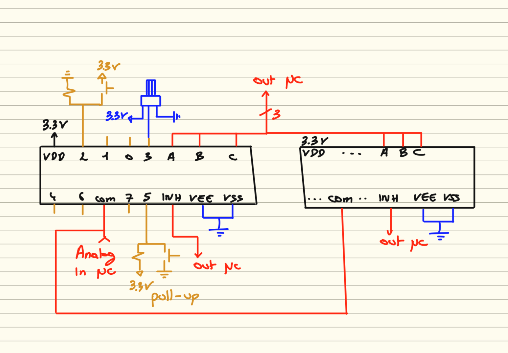

# CD4051 avec RP2040 (raspberry pico) en CircuitPython et C++


## [Branchements du/des CD4051](#aaa)

## Avec CircuitPython
- [Installation](#installation-de-circuitpython)
- [IDE](#thonny-ide)
- [Licence](#licence)
<br><br><br><br><br><br><br><br><br><br><br><br><br><br><br><br><br><br><br><br><br><br><br><br><br><br><br><br><br><br><br><br><br><br><br><br><br><br>
## aaa


### Installation de CircuitPython
 - Firmware : https://circuitpython.org/board/raspberry_pi_pico
 - circuitpython : https://github.com/adafruit/Adafruit_CircuitPython_Bundle/releases ou https://circuitpython.org/libraries
 - Reset si besoin d'une remise à 0 du RP2040 : https://www.raspberrypi.com/documentation/microcontrollers/pico-series.html#resetting-flash-memory

### Thonny IDE
[Télécharger ici](https://thonny.org). Lors de la programmation il faudra bien choisir circuitpython et non pas micropython.


## Programme pour 1 potentiomètre directement branché et aussi 1 potentiomètre sur le CD4051 (canal 1)

GP0 et GP1 sont utilisés car MIDI USB ≠ MIDI DIN (UART)
```
# ============================================================
# Contrôleur MIDI USB – RP2040 + CD4051
# Lissage EMA + seuil MIDI
# Compatible CircuitPython 10.x
# ============================================================

import board
import analogio
import digitalio
import time
import usb_midi
import adafruit_midi
from adafruit_midi.control_change import ControlChange

# ============================================================
# CONFIGURATION
# ============================================================

CANAL_MIDI = 6          # 0–15 (canal réel = +1)
CC_BASE = 20            # CC20 → CC27 (CD4051)
SEUIL_MIDI = 2          # seuil anti-jitter (0–127)
EMA_ALPHA = 0.25        # lissage (0.15–0.30 conseillé)
LOOP_DELAY = 0.005      # 5 ms

# ============================================================
# MIDI
# ============================================================

midi = adafruit_midi.MIDI(
    midi_out=usb_midi.ports[1],
    out_channel=CANAL_MIDI
)

# ============================================================
# CD4051 – GPIO
# ============================================================

S0 = digitalio.DigitalInOut(board.GP0)
S1 = digitalio.DigitalInOut(board.GP1)
S2 = digitalio.DigitalInOut(board.GP2)
INH = digitalio.DigitalInOut(board.GP3)

for pin in (S0, S1, S2, INH):
    pin.direction = digitalio.Direction.OUTPUT

adc_mux = analogio.AnalogIn(board.A0)

# ============================================================
# CD4051 – Fonctions
# ============================================================

def mux_enable(enable: bool):
    # INH actif à l'état HAUT → on inverse
    INH.value = not enable
    time.sleep(0.000005)  # ~5 µs (compatible CircuitPython)

def mux_select(channel: int):
    mux_enable(False)

    S0.value = bool(channel & 0b001)
    S1.value = bool(channel & 0b010)
    S2.value = bool(channel & 0b100)

    mux_enable(True)
    time.sleep(0.000005)

# ============================================================
# EMA – Lissage professionnel
# ============================================================

class EMASmoother:
    def __init__(self, alpha=0.25):
        self.alpha = alpha
        self.value = None

    def update(self, new_value):
        if self.value is None:
            self.value = new_value
        else:
            self.value += self.alpha * (new_value - self.value)
        return int(self.value)

# ============================================================
# Conversion ADC → MIDI
# ============================================================

def adc_to_midi(adc12: int) -> int:
    return max(0, min(127, (adc12 * 127) // 4095))

# ============================================================
# CD4051 – Canaux
# ============================================================
# 
# PORTS_MUX = list(range(8))
# ema_mux = [EMASmoother(EMA_ALPHA) for _ in range(8)]
# last_midi_mux = [-1] * 8

PORTS_MUX = [1]
ema_mux = ema_mux = [EMASmoother(EMA_ALPHA) for _ in range(8)]
last_midi_mux = [-1] * 8

# ============================================================
# Potentiomètres directs (optionnels)
# ============================================================

POTS_DIRECTS = [
    {
        "pin": analogio.AnalogIn(board.A1),
        "ema": EMASmoother(EMA_ALPHA),
        "cc": 30,
        "last": -1
    },
#     {
#         "pin": analogio.AnalogIn(board.A2),
#         "ema": EMASmoother(EMA_ALPHA),
#         "cc": 31,
#         "last": -1
#     },
]

# ============================================================
# DÉMARRAGE
# ============================================================

print("🎛️ Contrôleur MIDI USB – RP2040")
print("EMA + seuil MIDI")
print("Canal MIDI :", CANAL_MIDI)
print("Ports CD4051 :", PORTS_MUX)
print("===============================")

# ============================================================
# BOUCLE PRINCIPALE
# ============================================================

try:
    while True:

        # --- CD4051 ---
        for ch in PORTS_MUX:
            mux_select(ch)

            raw_adc = adc_mux.value >> 4      # 12 bits
            smooth_adc = ema_mux[ch].update(raw_adc)
            midi_val = adc_to_midi(smooth_adc)

            if abs(midi_val - last_midi_mux[ch]) >= SEUIL_MIDI:
                midi.send(ControlChange(CC_BASE + ch, midi_val))
                last_midi_mux[ch] = midi_val

        # --- Potars directs ---
        for pot in POTS_DIRECTS:
            raw_adc = pot["pin"].value >> 4
            smooth_adc = pot["ema"].update(raw_adc)
            midi_val = adc_to_midi(smooth_adc)

            if abs(midi_val - pot["last"]) >= SEUIL_MIDI:
                midi.send(ControlChange(pot["cc"], midi_val))
                pot["last"] = midi_val

        time.sleep(LOOP_DELAY)

# ============================================================
# ARRÊT PROPRE
# ============================================================

except KeyboardInterrupt:
    mux_enable(False)

    for ch in PORTS_MUX:
        midi.send(ControlChange(CC_BASE + ch, 0))

    for pot in POTS_DIRECTS:
        midi.send(ControlChange(pot["cc"], 0))

    print("\n📴 Arrêt – CC remis à zéro")


```
